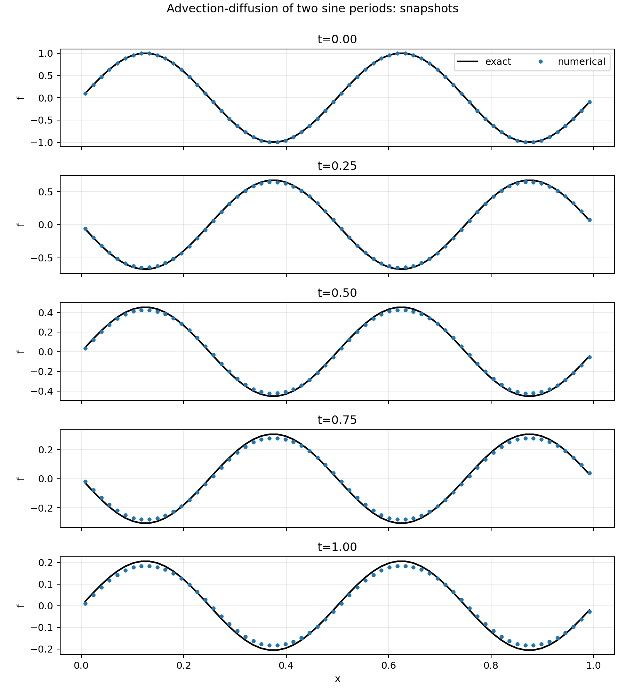
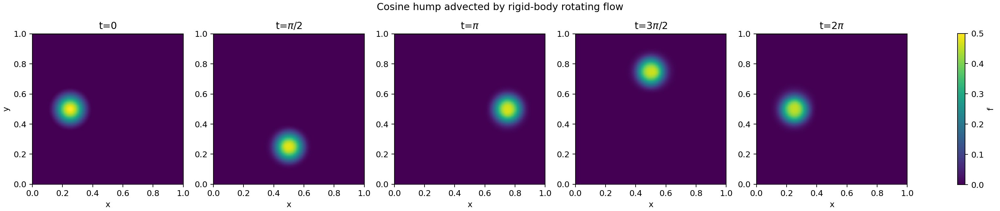

# Advection-Diffusion with Lanyon

## Highlights

* End-to-end formally verified solvers for the linear advection, isotropic advection-diffusion, and full/anisotropic advection-diffusion equations, in 1D, 2D, and 3D.
* **Took ~156 seconds for Lanyon to generate everything**.
  * ~7 seconds for linear advection in 1D, ~10 seconds for linear advection in 2D, ~27 seconds for linear advection in 3D, ~9 seconds for isotropic advection-diffusion in 1D, ~14 seconds for isotropic advection-diffusion in 2D, ~31 seconds for isotropic advection-diffusion in 3D, ~16 seconds for full advection-diffusion in 1D, ~29 seconds for full advection-diffusion in 2D, ~13 seconds for full advection-diffusion in 3D.
  * Real-time screen captures are shown in `/screencaps`.
* **9,578 of Lean 4 code** to prove end-to-end correctness properties.
  * 469 for linear advection in 1D, 829 for linear advection in 2D, 1,253 for linear advection in 3D, 554 for isotropic advection-diffusion in 1D, 1,056 for isotropic advection-diffusion in 2D, 1,703 for isotropic advection-diffusion in 3D, 554 for full advection-diffusion in 1D, 1,137 for full advection-diffusion in 2D, 2,023 for full advection-diffusion in 3D.
* **438 total definitions** and **282 total theorems**.
* **8,292 lines of formally verified C code**.
  * 441 for linear advection in 1D, 748 for linear advection in 2D, 1,097 for linear advection in 3D, 522 for isotropic advection-diffusion in 1D, 923 for isotropic advection-diffusion in 2D, 1,412 for isotropic advection-diffusion in 3D, 522 for full advection-diffusion in 1D, 983 for full advection-diffusion in 2D, 1,644 for full advection-diffusion in 3D.

## Further Details

The most general form of the advection-diffusion equation is:

$$ \frac{\partial f}{\partial t} + \nabla \cdot \left( \mathbf{u} f \right) = \nabla \cdot \left( \mathbf{D} \cdot \nabla f \right) $$

for (scalar) advected quantity $f$, advection velocity ${\mathbf{u}}$, and diffusion tensor ${\mathbf{D}}$. For full details of the equation, the numerical methods used for solving it, and the specific prompts used within Lanyon for running simulations, see [our technical deep dive on the advection-diffusion equation](https://lanyon.ai/research/advection-diffusion/).

